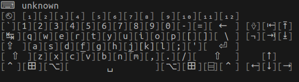

# keyboard-visualizer
terminal-based keyboard/keystroke visualizer



Run keyboard visualizer by
```bash
python keyboard_visualizer.py
```
or
```bash
./keyboard-visualizer.sh
```
It must be executed as root user.
